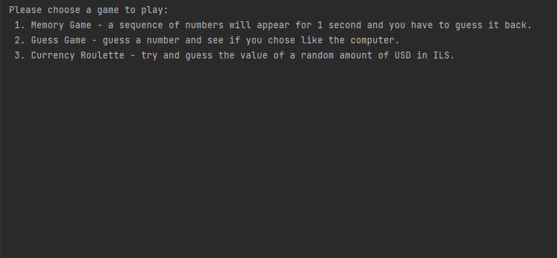
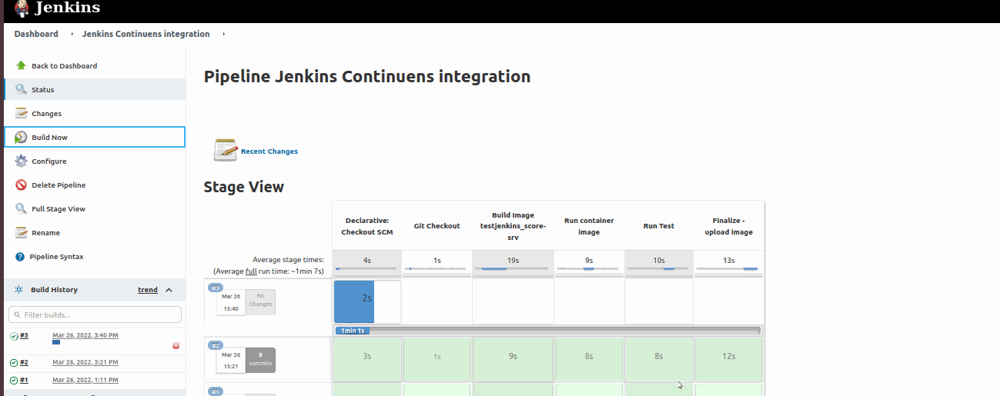

## Table of contents
* [Intro](#Intro)
* [Demo](#Demo)
* [Technologies](#technologies)
* [Setup](#setup)
* [CI/CD](#CI/CD)

## Intro 
In a DevOps training course, "World of Games" served as an example project which illustrates the
DevOps lifecycle by demonstrating integration between development and operations. 

As for the development part, I created the following two applications using Python coding:  
* Gaming platform that allows players to play a command line game of their choice 
* A Flask web server application and HTML page for publishing the player's score  
The player will need to select a game and difficulty level. To display the HTML web page, a Python flask module is used. Once running, you can access it from: 127.0.0.1:4000.

The operations side includes managing the applications code in git/github repositories and running it in a Jenkins Pipeline using Jenkins files to create stages, Docker (and Docker-compose) to package the Flask Web app into a container, and Selenium tests to test the games score. 

## Environment and requirements:
* Ubuntu 18.04 was used as the operating system for Jenkins master and testing node.
* Python 3.10
* Jenkins and Docker are needed to run the testing pipeline
* Flask (will be installed in by the dockerfile)
  ### installed Via Dockerfile and JenkinsFile:
* Selenium (will be installed on the node)
* In the 'Tests' folder is the following chromedriver version: 99.0.4844.51-0ubuntu0.18.04.1
* The version of Chrome that will be installed is 99.0.4844.51-0ubuntu0.18.04.1

<h4 dir="auto"> </a>&nbsp;&nbsp;&nbsp;&nbsp;&nbsp;&nbsp;&nbsp;</h4>

## CLI mini-games contains: 
* *Memory Game* - a sequence of numbers will appear for 1 second and you have to
guess it back
* *Guess Game* - guess a number and see if you chose like the computer
* *Currency Roulette* - try and guess the value of a random amount of USD in ILS
    # Guess Game Demo

    # Setup
To run this games, Download it locally to your Pycharm IDE/Linux OS:
* install python3
* Run Python3 MainGame.py

## Continues integration
    # Following stages are demonstrated in the Jenkins pipeline:
1. **Checkout** - repository checkout.
2. **Build** - build our docker image.
3. **Run** - will run our dockerized application. The application will expose the port 8777 on
localhost, and a dummy Scores.txt will be mounted to it in order to server the results for
the tests.
4. **Test** - With our e2e.py file it will selenium test our scores web service and fail the
pipeline if the tests failed.
5. **Finalize** - Will terminate our tested container and push to DockerHub the new image we created.

## Continues integration requires the following prerequisites:
For Jenkins to run all stages successfully
* Master & Node on a Ubuntu 18.04 OS for POC
* To avoid permission issues, you may add user 'jenkins' to the sudoers file (Jenkins ALL=(ALL) NOPASSWD: ALL)
* in the 'Finalize - upload image' stage requires changing the 'echo' to 'sh' and adding your own credentials         

Enjoy :smile: 
